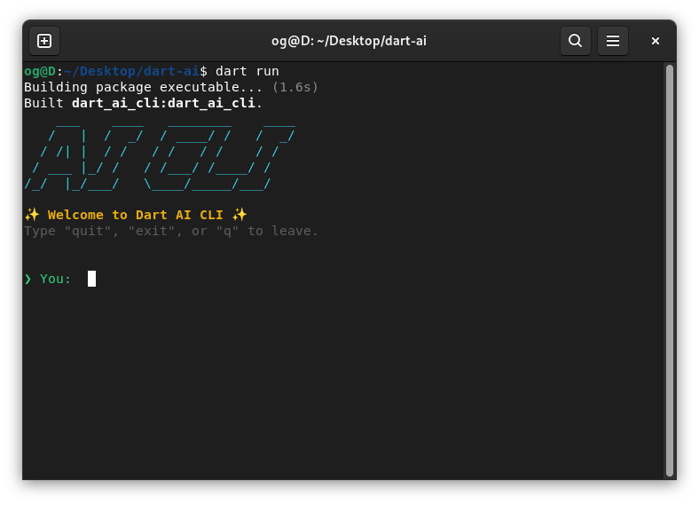

# Dart-Ai CLI

[](https://dart.dev)
[](https://opensource.org/licenses/MIT)

Manage local workspaces using natural language commands, powered by Google Genkit for Dart and Gemini.

---

## 🖥️ Terminal Preview


---

## 🛠️ Key Capabilities

### 🧠 Agentic & Contextual Execution
* **Autonomous Reasoning**: Evaluates outcomes at each stage and performs follow-up actions autonomously (up to 10 steps per prompt).
* **Session Memory**: Retains discussion context and prior commands within the current session.
* **Token Transparency**: Reports exact prompt and completion tokens used after each execution cycle.

### 📁 Workspace Integration
* **File Operations**: Full CRUD support (`create`, `read`, `update`, `append`, `delete`, `list`, `rename`).
* **Shell Commands**: Runs local environment shell commands (e.g., `flutter pub get`) safely within the working directory.

---

## ⚙️ Setup & Execution

### Prerequisites
* Dart SDK installed.
* Google Gemini API key configured in your environment variables.

### Running the CLI
Start the application from your terminal:

```sh
dart run
```

*To terminate the active session, enter `quit`, `exit`, or `q`.*